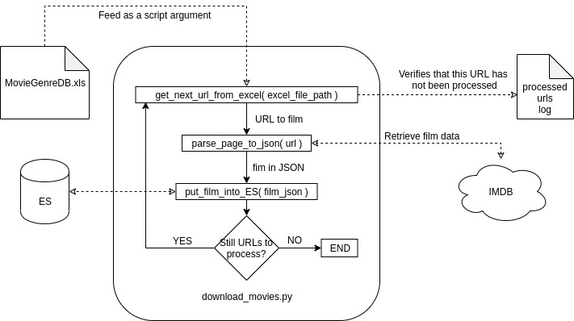

# IMDB Web Scrapping Into Elastic Search Instance. 

#### A simple script procedure in Python to extract text information about thousands of films in IMDB using Python3. 

#### Elements
- **MovieGenreDB.xls:** An excel file containing a list of movie movies where one of the attributes is the URL of the film in IMDB. 
- **ES:** Our ElasticSearch instance with an endpoint on ‘localhost:9200’. 
- **Processed URLs Log:** To have a more robust operation, the script stores the already processed URLs in a file, which is reviewed every time the script starts to avoid downloading the same film several times into ES. 
- **IMDB:** Is the remote website where the information is scrapped from. At this point, IMDB is located at the domain www.imdb.com.

#### What I learned
- Collection of information on websites using automation. 
- Notions about the Elastic Search database and search engine. 
- Concurrent programming in Python3 using the pypy3 interpreter. 
